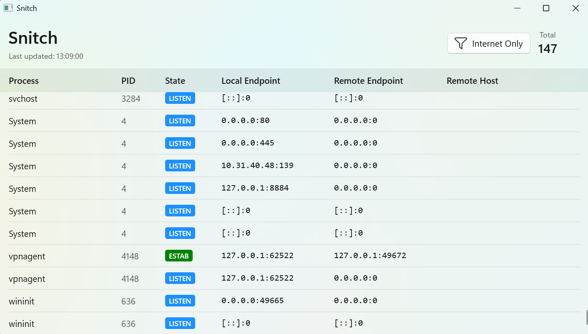

# Snitch

Snitch is a Windows desktop tool that shows active TCP connections on your machine, grouped by process details and endpoint information.



It is built with WinUI 3 and .NET 10, and refreshes connection data automatically every 5 seconds.

## Features

- Lists IPv4 and IPv6 TCP connections
- Shows process name, PID, executable path, connection state, local/remote endpoints, and remote hostname
- Color-codes TCP connection state for quick scanning
- Includes an **Internet Only** toggle to hide local-loopback traffic
- Displays live status and total connection count

## Requirements

- Windows 10 (17763+) or Windows 11
- .NET 10 SDK
- Workloads/dependencies required for WinUI 3 desktop apps

## Build

```powershell
dotnet restore
dotnet build .\snitch.csproj
```

## Run

Run from Visual Studio (recommended for WinUI desktop development), or use:

```powershell
dotnet run --project .\snitch.csproj
```

## How it works

- `NetworkHelper` reads the system TCP tables via `iphlpapi.dll` (`GetExtendedTcpTable`) for IPv4 and IPv6.
- Process metadata is resolved from the owning PID.
- Remote hostnames are reverse-resolved with a short timeout and cached.
- `MainViewModel` refreshes and filters data, then updates the UI.

## Notes

- Some system processes may not expose executable paths due to access restrictions.
- Reverse DNS lookups are best-effort and may be empty for many endpoints.

## Contributing

See [CONTRIBUTE.md](./CONTRIBUTE.md) for contribution guidance.
